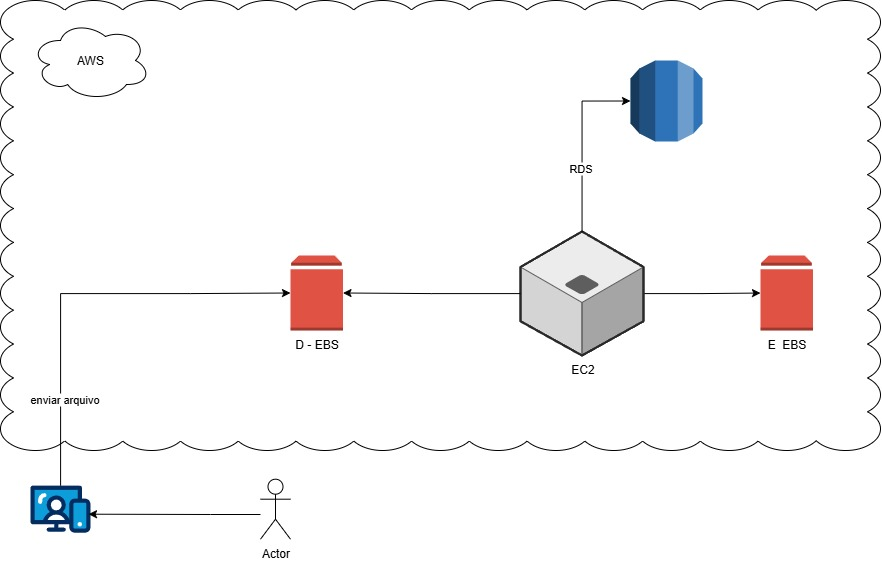
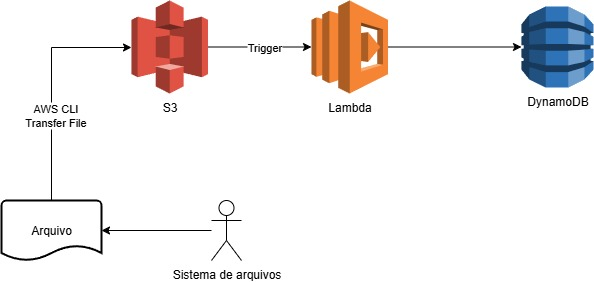

# aws-gerenciando-instancias-ec2
Este repositório contém o conteúdo referente ao laboratório de prática da DIO - Gerenciando Instâncias EC2 na AWS

## Desafio de Arquitetura
- Acessar o site [Draw.io](https://www.drawio.com/), baixar o programa e instalar
- Criar o desenho de nossa arquitetura com S3 / EC2 / Lambda Function / EBS
- Disponibilizar na plataforma DIO

## Imagens das arquiteturas

